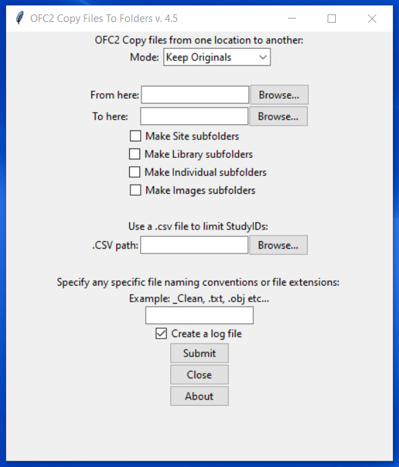

# Copy Files To Folders
A Python program to copy all subject files (or a select list of subject files from a .csv, or a file naming convention, or by file type) from one location to another and create certain subfolders if necessary

(customized to work for studies at the CCDG clinic at the University of Pittsburgh)

# What I Learned
* Design a UI using tkinter and the ttk theme widgets
* Practice using the functions in the shutil module to copy files
* Practice using the functions in the os module to manipulate file locations 
* Use the pathlib module to handle file path names better cross platform
* Use a .csv file to limit the subject files that can be moved (This way if a random list of subjects is given, the program will select out only those subject files to move and not everyone)
* Compile as an .exe for both Windows and macOS. Tested using pyinstaller and py2exe (for Windows) and py2app (for Mac).

